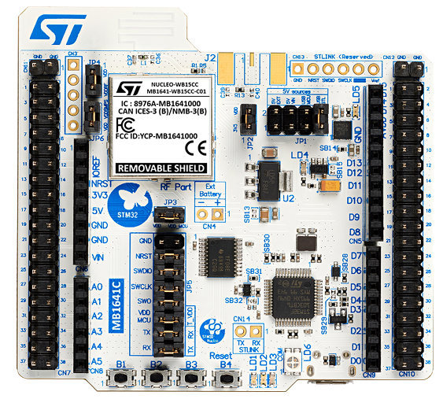
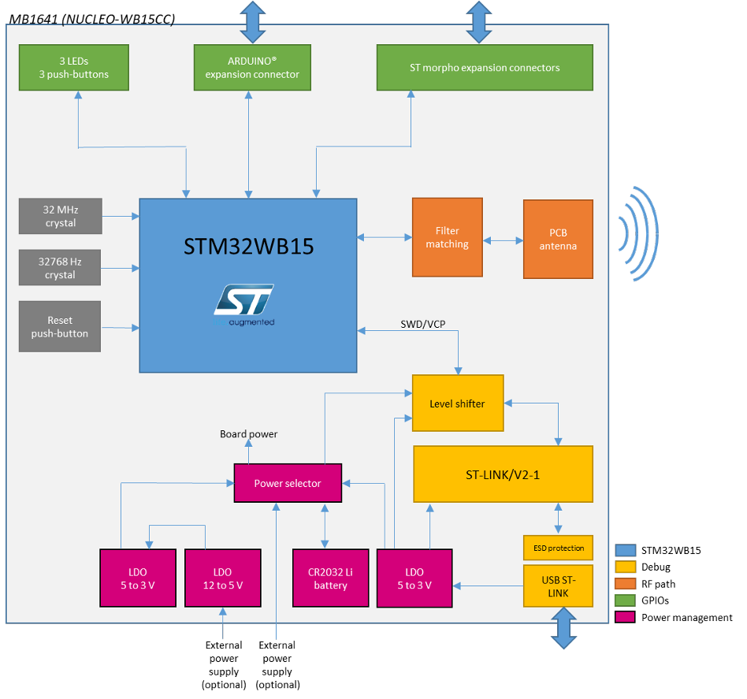
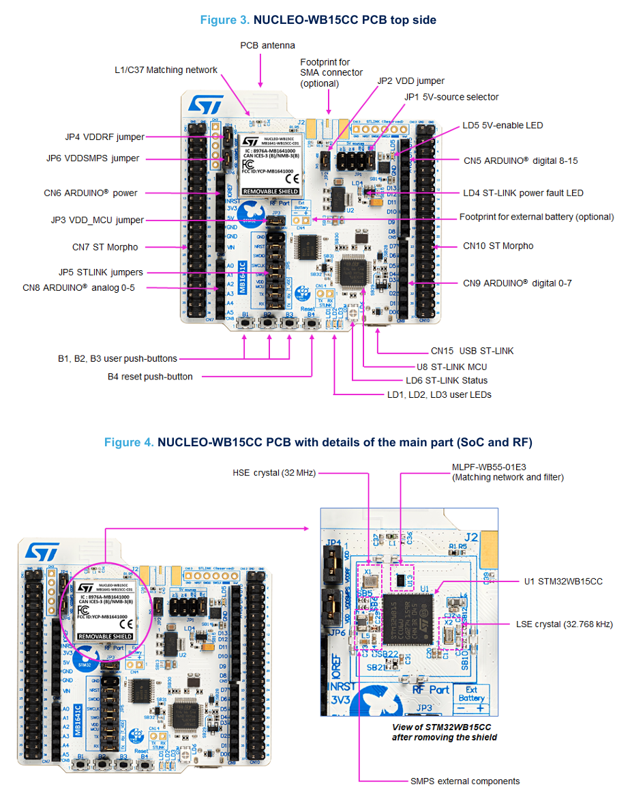
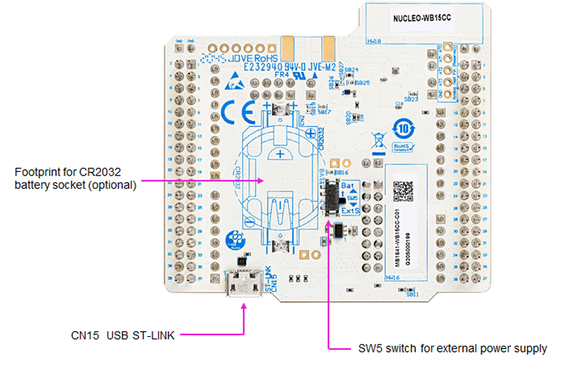
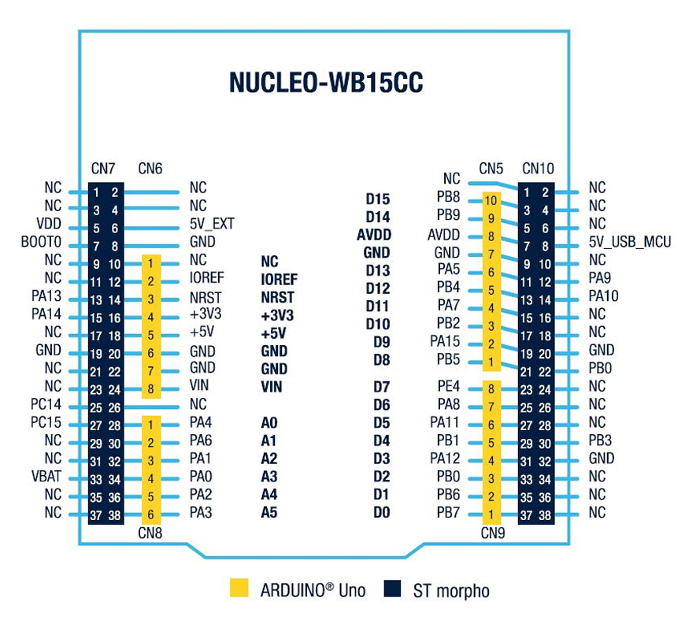
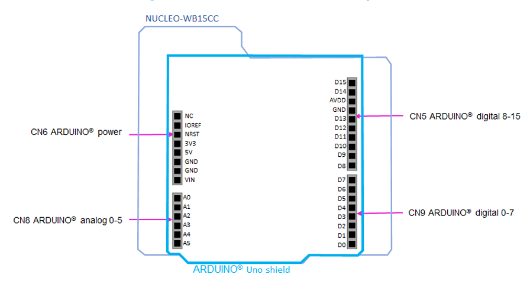
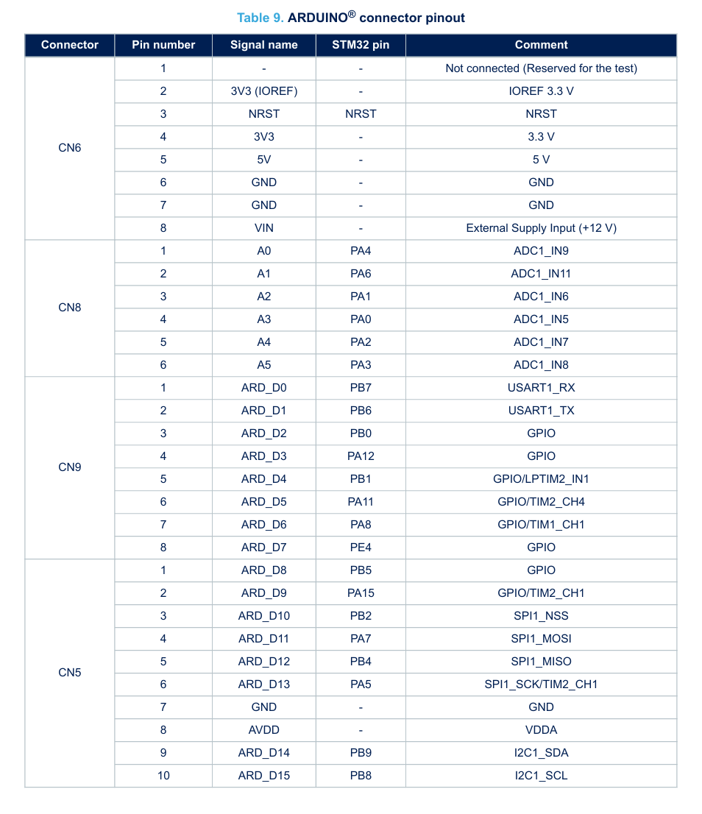
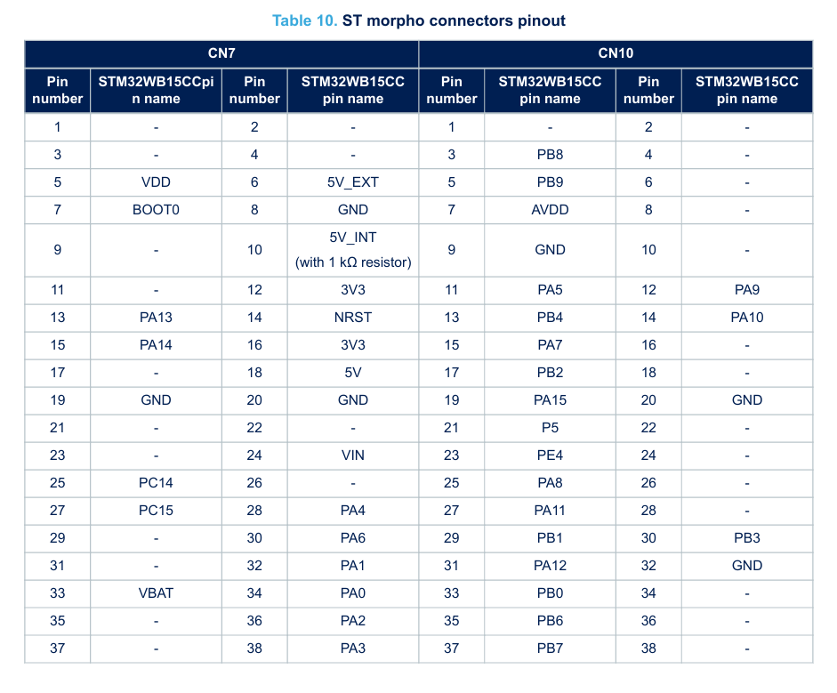

# NUCLEO-WB15CC

## Testing STM32WB15CC

---

## Spis treści
1. [Schematic](#Schematic)
2. [Useful links](#Useful_links)
4. [Useful videos](#Useful_videos)
5. [Pinout](#Pinout)
6. [Functions](#Functions)
7. [Terminology and theory](#Terminology_and_theory)
---

## Schematic






[File with schematic](Datasheets/schemat.pdf)

---

## Useful_links

- [ST page](https://www.st.com/en/evaluation-tools/nucleo-wb15cc.html)

---

## Useful_videos

- [ST Getting Started](https://www.youtube.com/watch?v=7_wBH7mTQ2g&list=PLnMKNibPkDnG9JRe2fbOOpVpWY7E4WbJ-&index=1)
---

## Pinout




---

## Functions

---

## Terminology and theory
HSEM - Hardware semaphore wich is used to synchronize access to shared resources between CM0+ and CM4 cores.

IPCC - Interprocessor communication controller is used to exchange data between CM0+ and CM4 cores.

GATT - Generic Attribute Profile is API for BLE communication.

GATT terminology:
- Client - A device that initiates GATT commands and requests, and accepts responses, for example, a computer or smartphone.
- Server - A device that receives GATT commands and requests, and returns responses, for example, a temperature sensor.
- Characteristic - A data value transferred between client and server, for example, the current battery voltage.
- Service - A collection of related characteristics, which operate together to perform a particular function. For instance, the Health Thermometer service includes characteristics for a temperature measurement value, and a time interval between measurements.
- Descriptor - A descriptor provides additional information about a characteristic. For instance, a temperature value characteristic may have an indication of its units (e.g. Celsius), and the maximum and minimum values which the sensor can measure. Descriptors are optional – each characteristic can have any number of descriptors.
- Identifier - Services, characteristics, and descriptors are collectively referred to as attributes, and identified by UUIDs. Any implementer may pick a random or pseudorandom UUID for proprietary uses, but the Bluetooth SIG have reserved a range of UUIDs (of the form xxxxxxxx-0000-1000-8000-00805F9B34FB[55]) for standard attributes. For efficiency, these identifiers are represented as 16-bit or 32-bit values in the protocol, rather than the 128 bits required for a full UUID. For example, the Device Information service has the short code 0x180A, rather than 0000180A-0000-1000-... . The full list is kept in the Bluetooth Assigned Numbers (https://www.bluetooth.com/specifications/assigned-numbers/) document online.
```

